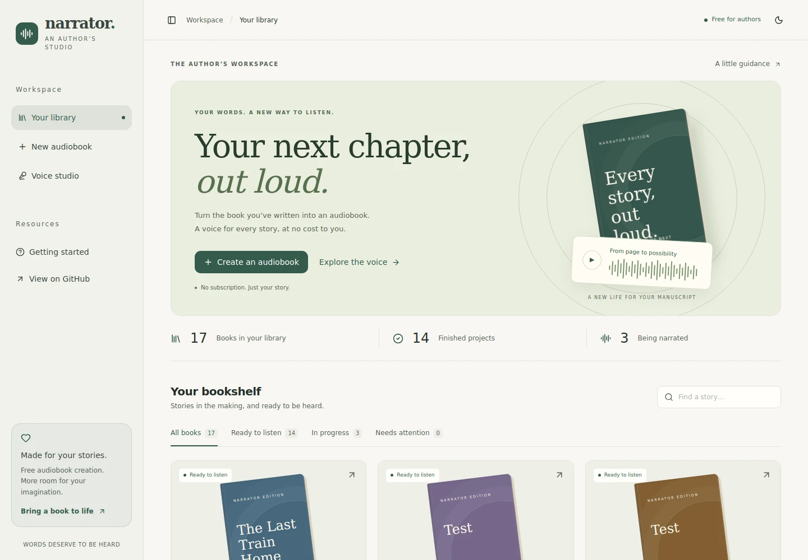

# Narrator - AI Audiobook Generator

A free audiobook studio for authors. Upload a manuscript, review your narrator, and listen chapter by chapter.

## Project Overview

Narrator is a full-stack web application that converts written manuscripts (PDF, DOCX, TXT) into professionally narrated audiobooks using AI voice synthesis. The application provides a complete workflow from manuscript upload to audio playback with chapter navigation.

**Business Purpose**: Automate the audiobook creation process by eliminating the need to hire voice talent, book studio time, and perform manual post-production.

## Tech Stack

| Layer | Technology |
|-------|-------------|
| Framework | Next.js 16 (App Router) |
| Language | TypeScript |
| UI Components | Radix UI + shadcn/ui |
| Styling | Tailwind CSS 4 |
| Form Handling | React Hook Form + Zod |
| Icons | Lucide React |
| Charts | Recharts |
| Storage | JSON file system or SQLite (`NARRATOR_STORAGE_BACKEND=sqlite`) |

## Architecture Overview

```
┌─────────────────────────────────────────────────────────────────┐
│                        FRONTEND (React)                        │
│  Dashboard Layout → Upload → Voices → Processing → Player     │
└─────────────────────────────────────────────────────────────────┘
                              ▼
┌─────────────────────────────────────────────────────────────────┐
│                     BACKEND (Next.js API Routes)               │
│  /api/books → CRUD operations                                 │
└─────────────────────────────────────────────────────────────────┘
                              ▼
┌─────────────────────────────────────────────────────────────────┐
│                    DATA LAYER (File System)                    │
│  data/books.json (metadata), data/uploads/ (manuscripts)     │
└─────────────────────────────────────────────────────────────────┘
```

## Key Features

- **Manuscript Upload**: Support for PDF, DOCX, and TXT files
- **Voice Studio**: Preview the included English Lessac voice before starting narration
- **Real-time Progress Tracking**: Live chapter-by-chapter generation progress
- **Audio Playback**: Built-in player with chapter navigation and playback controls
- **Chapter Downloads**: Download real WAV files when chapter audio is available; MP3, M4B, and ZIP exports remain unimplemented
- **Author Library**: Search by title/author, filter by project status, and safely confirm deletion
- **Dark/Light Theme**: Toggle between themes

## Author studio redesign

The interface uses warm paper surfaces, forest-green accents, editorial headings, and book covers. The creation form keeps your manuscript details until you approve narration, and reuses an uploaded book when retrying a failed generation request. A getting-started guide is available at `/guide`.




### Current backend limitations

This redesign does not replace the narration backend. The bundled Piper executable is Windows-only. PDF/DOCX extraction is experimental, progress reconciliation can still simulate completion without playable audio, and the legacy export API returns placeholders. The listening room only enables chapters with audio URLs and offers their actual WAV files. Use TXT for the most reliable manuscript input. Persistent storage and a compatible speech engine are still needed for hosted production use.

## Setup & Installation

### Prerequisites

- Node.js 18+
- pnpm (recommended) or npm

### Installation

```bash
# Install dependencies
pnpm install

# or with npm
npm install
```

## How to Run

```bash
# Start development server
pnpm dev

# Build for production
npm run build

# Start production server
npm start
```

The application runs at `http://localhost:3000`.

If the studio layout appears unstyled after switching branches, stop the running
server and start with `npm run dev:clean` (or `pnpm dev:clean`). This clears only
Next.js generated output before starting development. Make sure you are running
`feat/author-studio-redesign` while its pull request is open.

## Deploy to Vercel

The project is configured for Vercel's automatic Next.js detection and does not
require a custom build command. From the repository root, deploy with:

```bash
npx vercel@latest
npx vercel@latest --prod
```

Alternatively, import the repository in the Vercel dashboard and keep the
detected framework preset set to **Next.js**. No environment variables are
required to render the bundled demo data.

> **Runtime storage:** Vercel Functions have an ephemeral filesystem. The
> bundled JSON records and audio are suitable for a demo deployment, but new
> uploads and generated audio are not durable across function invocations.
> Connect a persistent database and object-storage provider before using the
> upload and generation workflow in production. The bundled Piper executable is
> also Windows-only, so server-side speech generation requires a Linux-compatible
> TTS service or binary on Vercel.

## Folder Structure

```
Narrator/
├── app/                      # Next.js App Router
│   ├── (dashboard)/         # Dashboard pages group
│   │   ├── page.tsx        # Main dashboard
│   │   ├── upload/         # Manuscript upload
│   │   ├── voices/         # Voice selection
│   │   ├── processing/     # Generation progress
│   │   └── player/        # Audio playback
│   └── api/               # API routes
│       └── books/         # Book endpoints
├── components/             # React components
│   ├── ui/               # shadcn/ui components
│   └── *.tsx             # Feature components
├── lib/                  # Core logic
│   ├── audiobook-types.ts  # TypeScript interfaces
│   ├── server/           # Server-side logic
│   │   └── audiobook-store.ts  # Data operations
│   └── utils.ts          # Utility functions
└── data/                 # Runtime data storage
    ├── books.json        # Book metadata
    └── uploads/          # Uploaded files
```

## API Endpoints

| Method | Endpoint | Description |
|--------|----------|--------------|
| GET | `/api/books` | List all books |
| POST | `/api/books` | Create new book |
| GET | `/api/books/[id]` | Get book details |
| POST | `/api/books/[id]/generate` | Start audio generation |
| GET | `/api/books/[id]/download` | Download audiobook files |
| GET | `/api/books/[id]/status` | Get live status snapshot for one book |
| GET | `/api/books/[id]/chapters` | List chapter statuses (optional `?status=` filter) |

### Response Envelopes for Polling Endpoints

The `/api/books/[id]/status` and `/api/books/[id]/chapters` endpoints now include additive envelope metadata for stable client polling while preserving existing fields.

#### `GET /api/books/[id]/status`

Sample response:

```json
{
  "status": {
    "bookId": "4f2f5eb2-52ad-49f0-bbc7-7ca0f5d4ad9a",
    "status": "processing",
    "progress": 42,
    "chapterStats": {
      "total": 12,
      "completed": 5,
      "processing": 1,
      "pending": 6,
      "failed": 0
    },
    "activeChapter": {
      "id": "4f2f5eb2-52ad-49f0-bbc7-7ca0f5d4ad9a-chapter-6",
      "name": "Chapter 6",
      "status": "processing",
      "duration": null
    },
    "startedAt": "2026-03-25T10:11:12.000Z",
    "updatedAt": "2026-03-25T10:12:13.000Z"
  },
  "apiVersion": "2026-03-25",
  "generatedAt": "2026-03-25T10:12:13.100Z",
  "bookId": "4f2f5eb2-52ad-49f0-bbc7-7ca0f5d4ad9a",
  "updatedAt": "2026-03-25T10:12:13.000Z",
  "revision": 1774433533000
}
```

#### `GET /api/books/[id]/chapters`

Sample response:

```json
{
  "chapters": [
    {
      "id": "4f2f5eb2-52ad-49f0-bbc7-7ca0f5d4ad9a-chapter-1",
      "name": "Chapter 1",
      "status": "completed",
      "duration": "8:00"
    },
    {
      "id": "4f2f5eb2-52ad-49f0-bbc7-7ca0f5d4ad9a-chapter-2",
      "name": "Chapter 2",
      "status": "processing",
      "duration": null
    }
  ],
  "apiVersion": "2026-03-25",
  "generatedAt": "2026-03-25T10:12:13.100Z",
  "bookId": "4f2f5eb2-52ad-49f0-bbc7-7ca0f5d4ad9a",
  "updatedAt": "2026-03-25T10:12:13.000Z",
  "revision": 1774433533000
}
```

#### Added envelope fields

- `apiVersion` (`string`): API envelope version for client compatibility checks.
- `generatedAt` (`string`, ISO 8601): server timestamp when the response payload was generated.
- `bookId` (`string`): stable identifier of the requested book at the top level.
- `updatedAt` (`string`, ISO 8601): latest `BookRecord.updatedAt` value for change detection.
- `revision` (`number`): epoch-millisecond numeric revision derived from `updatedAt` for efficient monotonic polling comparisons.

> Backward compatibility note: existing `status` and `chapters` fields are unchanged and remain present.

## User Flow

1. **Upload**: User uploads manuscript (PDF/DOCX/TXT) with title, author, and language
2. **Narrator & Review**: Preview the included voice and review manuscript details before any upload or generation request
3. **Processing**: System generates audiobook chapter-by-chapter with real-time progress
4. **Playback**: User can listen to the audiobook and download in various formats

## How to Test

1. Start the development server: `pnpm dev`
2. Open `http://localhost:3000`
3. Click "Create an audiobook"
4. Choose a manuscript and fill in its title and author
5. Continue to the narrator, preview the voice, and review the details
6. Click "Create my audiobook" and follow chapter progress
7. Open the listening room, play available audio, and download WAV chapters

## Development Notes

- **Audio Generation**: Currently simulated based on elapsed time. To make it real, integrate an AI TTS service (ElevenLabs, PlayHT, Azure Speech) in the `startGeneration()` function in `lib/server/audiobook-store.ts`.
- **Storage**: Uses JSON file storage by default. Set `NARRATOR_STORAGE_BACKEND=sqlite` to store records in `data/books.sqlite`.
- **Data Location**: Books are stored in `data/books.json`, uploads in `data/uploads/`.
- **Storage Migration Script**: Use `scripts/migrate-storage.ts` to copy records between JSON and SQLite and validate counts/IDs.
  - JSON ➜ SQLite: `node --experimental-strip-types scripts/migrate-storage.ts --from=json --to=sqlite`
  - SQLite ➜ JSON: `node --experimental-strip-types scripts/migrate-storage.ts --from=sqlite --to=json`

## Contribution Guidelines

1. Fork the repository
2. Create a feature branch: `git checkout -b feature/my-feature`
3. Make your changes and add tests if applicable
4. Ensure code passes linting: `pnpm lint`
5. Commit your changes: `git commit -m "Add my feature"`
6. Push to the branch: `git push origin feature/my-feature`
7. Create a Pull Request

## License

Private - All rights reserved.
