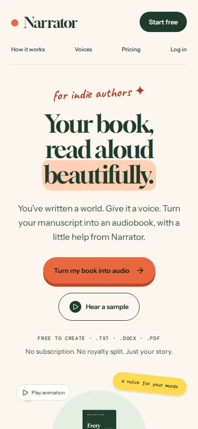
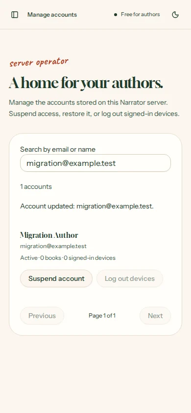

# Account management and saved requests

Authors sign in to Narrator's own SQLite-backed account system, manage their profile/password/devices, and see narration requests retained across restarts. The operator manages accounts through an authenticated page. `npm start` now brings up both the web app and real narration worker.

## Verified on 2026-10-08

| Boundary | Evidence |
| --- | --- |
| Existing accounts → upgraded schema | An account created without the admin plugin signs in after migration with its original password. |
| Public signup → author role | Supplying `role: admin` is rejected; ordinary signup cannot use operator APIs. |
| Operator bootstrap → sessions | Server CLI promotes an existing account and revokes its old session; it cannot demote the last active administrator. |
| Operator actions → account database | Search and book/device counts work; suspension revokes sessions and blocks sign-in; restoration retains the author's book; explicit device revocation invalidates existing cookies. |
| Author account → saved profile/password | Profile changes survive reload/restart. A wrong current password is rejected; a successful password change invalidates the old password and other devices. |
| Upload → worker → real audio | The combined launcher starts a healthy web server and worker; an actual manuscript produces downloadable Piper/FFmpeg audio. |
| Job transitions → saved history | Queue/start/completion events belong to the book owner and survive restarting both processes. Failed synthesis, failed MP3 export, retry and recovered worker attempts also retain their events. Deleting a book removes its history. |
| API boundaries | Unauthenticated callers get 401; authors get 403 on operator APIs and 404 on the operator page. Cross-origin writes, invalid actions, oversized bodies and malformed paging are rejected. Searches treat SQL-like text literally. The plugin's broad admin endpoints, including encoded/duplicate-slash variants, are unavailable over HTTP. |
| Browser → UI | Mobile profile updates, device logout, history-to-book navigation and operator suspend/restore actions pass in Chromium with no page errors. Axe WCAG 2 A/AA and 2.1 AA checks pass on the three new screens. |
| Mobile landing page | Title bounds are centered at 320, 375, 390, 430 and 767 px; desktop retains its existing alignment. No horizontal overflow at these widths or 1440 px. |

The isolated account suite uses a temporary private data directory, real authentication cookies, migrations and the complete runtime. The existing backend suite verifies ownership, CSRF, extraction, Range playback, MP3/ZIP exports, recovery, retries and deletion. Production build, TypeScript and diff checks pass.

Run `npm run test:accounts` and `npm run test:backend` after installing narration dependencies. Add `NARRATOR_BROWSER_TESTS=1` and the browser import/path variables documented in README for browser checks.

## Running the in-house system

1. Follow the README dependency/model setup, or use Docker Compose.
2. Local production: `npm run build` then `npm start`. Docker: `docker compose up --build -d`.
3. Create an account through `/signup`.
4. On the server, run `npm run accounts -- promote YOUR_EMAIL` and sign in again. With Docker, run it through `docker compose exec web`.
5. Use **Manage accounts**, **Your account** and **Request history** from the sidebar. `npm run accounts -- status` reports saved counts and worker heartbeat status.

Keep `NARRATOR_DATA_DIR` on persistent storage. Back up its database, manuscripts/audio and auth secret with the processes stopped. The app does not require a hosted auth provider or paid database. Email verification/recovery remain unconfigured. This change was verified locally; no live server deployment was changed. Docker is unavailable in this workspace, so the image build was not executed.

