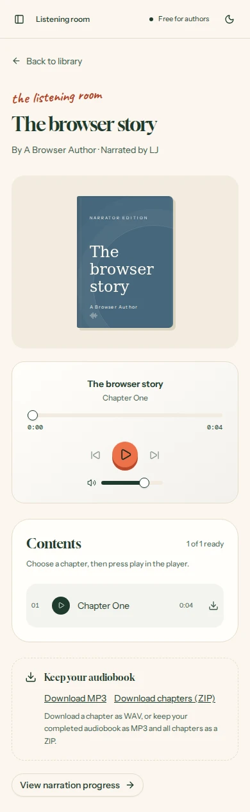

# Backend verification — 7 October 2026

**Story:** An author creates an account, uploads a manuscript, reviews their narrator, receives a real audiobook in a private library, then listens and downloads it. The saved account, manuscript and narration survive application restarts.

| Boundary | Result | Evidence |
| --- | --- | --- |
| Signup and login | Passed | Better Auth session cookie, HTTP-only/SameSite flags, persisted login after server restart and revoked session after logout |
| Private library | Passed | Another account received 404 for book details, status, chapters, narration, deletion, downloads and chapter audio; unsigned requests received 401 |
| Manuscript upload | Passed | Real TXT, DOCX and text-PDF fixtures parsed into chapters; malformed DOCX, empty/scanned PDF, binary TXT, unsupported extensions and oversized files rejected |
| Automatic narration | Passed | Upload persisted a queued job; Piper created WAV files containing real audio; progress became 100 only after valid MP3 export |
| Playback and exports | Passed | Browser audio played; keyboard playback/volume sliders operated; byte/suffix Range requests returned 206, invalid ranges 416; FFprobe recognized MP3 duration and Python verified ZIP chapter WAVs |
| Retry and persistence | Passed | Duplicate uploads created one book/job; crashed worker recovered; missing-model failure could be retried; an FFmpeg failure preserved completed chapter paths and reused them on retry |
| Browser author story | Passed | Chromium at 390px: signup → upload/review → narration → listening room → playback/download → logout → invalid and valid login; external `next` URL stayed in the library |
| Accessibility | Passed | Axe WCAG 2 A/AA and 2.1 AA checks on login, signup, player, mobile library and desktop library; automated checks do not replace manual accessibility review |
| Build and dependencies | Passed | Next.js 16.4 production build, independent TypeScript check, `git diff --check`, npm production dependency audit: zero known vulnerabilities |

The integration suite uses an isolated temporary SQLite database, two HTTP accounts and a third browser account. It invokes the actual Python parsers, Piper voice and FFmpeg; successful narration is not mocked. Failure tests intentionally remove the model or FFmpeg executable. Short manuscripts and a multi-chunk chapter were tested; a full 100,000-word book was not benchmarked.

Docker is unavailable in this workspace, so the Compose image build itself has not been executed. The same production web process, worker, SQLite, Python dependencies and FFmpeg pipeline were exercised locally. No live deployment was changed. The complete backend requires a persistent server and worker, as documented in the README; ephemeral serverless hosting is insufficient.

