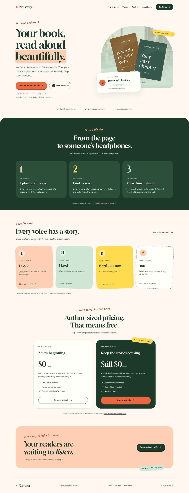
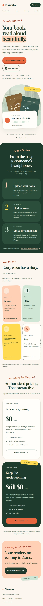

# Author studio preview and validation

The redesign follows the author's storybook theme: cream and forest green, coral
buttons with pressed shadows, peach highlights, rounded cards, handwritten notes,
and tilted stickers. The existing book-cover placeholders are preserved.

## Storybook landing page and studio

- `/` is the public landing page; `/library` is the author’s bookshelf. Creation,
  progress, listening, and guide routes keep their existing URLs.
- Gloock, Instrument Sans, Caveat, and DM Mono are self-hosted with their OFL
  licenses in `public/fonts`. They do not require runtime Google Fonts requests.
- Pricing stays free in keeping with the project’s purpose. There is no fictional
  login or paid checkout.
- Lessac is the available narrator. Hazel, Bartholomew, and voice cloning are
  explicitly labeled concepts; no unsupported voice count or retailer export
  promise is presented.
- Landing sample controls play the repository’s bundled narration WAV, support
  pause/resume, report playback errors, and pause the other sample player.
- The library photo remains in the studio header and also sits behind the landing
  page’s book-cover display. No new illustration or mascot was added.
- The palette, fonts, pill buttons, chapter steps, cards, and focus treatment carry
  through upload, voice selection, progress, listening, and the guide. Book covers
  retain their original layout and typography.

## Narrator identity and header

The custom logo combines an open book with three sound bars. Forest green, cream,
and warm gold keep the mark recognizable at small sizes. Editable SVG marks and
light/dark wordmarks live in `public/brand`, alongside the multi-size ICO,
32-pixel PNG favicon, and 180-pixel Apple touch icon. Browser metadata uses new
asset paths so the former favicon does not persist through the old cache key.

The library photograph supplied by the project author is used for the dashboard
header. It is encoded as WebP without changing the source composition, with
responsive cropping and a dark overlay for readable text in either theme.
Desktop/mobile layouts, icon responses, header loading, and light/dark homepage
accessibility were verified after these updates.

## Workflow changes

- Manuscript details remain in the form until the author reviews the narrator and starts creation.
- Empty or unsupported files are rejected; titles are suggested from filenames.
- Narration requests are awaited. A failed request retains the uploaded book ID so retrying does not upload another copy.
- Voice previews support pause/resume, report failures, and release audio objects when leaving the page.
- Progress polling stops at terminal statuses and exposes load errors and recovery links.
- The listening room only selects chapters with audio URLs. It links directly to real WAV audio instead of the placeholder export endpoint.
- Deletion requires confirmation and reports API failures.

## Validation

- `npm run build` passed.
- `npx tsc --noEmit` passed independently of the repository's existing `ignoreBuildErrors` setting.
- Playwright checks passed for library search/filtering, file validation, review-before-upload, preserved form details, mobile navigation, deletion/cancellation, and theme switching.
- Real API upload, readback, and deletion were checked with a temporary TXT manuscript; bundled WAV playback and download were checked in the browser.
- Generation failure was mocked to verify retained upload state and retry without duplicate uploads. This does not validate successful speech generation.
- Review layouts had no horizontal overflow at 320, 390, and 768 pixels. Desktop/mobile screenshots were visually inspected.
- Axe checks found no WCAG 2 A/AA or WCAG 2.1 AA violations on the six main pages in their default states. Automated checks do not replace manual accessibility review.
- The storybook landing page passed overflow and Axe checks at 320, 360, 390, 768,
  1024, and 1440 pixels. The updated studio passed default-state Axe checks on its
  six pages, plus the library's dark theme. Updated studio routes had no horizontal
  overflow at 320 and 390 pixels. Navigation into the studio, return-to-library
  links, real landing audio playback/pause, sample exclusivity, and reduced-motion
  scrolling were checked in the browser.
- The refreshed mobile manuscript review passed Axe checks. File selection,
  review, edit-state retention, mobile sidebar dismissal, library search, and
  pausing audio when leaving the landing page were also verified.
- `npm run lint` is blocked by the existing missing ESLint dependency/configuration.

## Local development stylesheet recovery

The studio theme and component rules now live in `app/studio.css`, explicitly
imported by the dashboard layout. This keeps the new interface styling in the
same import graph as the new dashboard rather than relying on an older cached
base stylesheet. Clean development rendering was verified on desktop and mobile,
including a check using the original base stylesheet alongside the studio file.

For local layouts that still display the old styles, stop the dev server, pull
this branch, and run `npm run dev:clean` or `pnpm dev:clean`. The command removes
only generated `.next` output before restarting Next.js.

## Existing backend limitations

The real preview request returns an error on Linux because the bundled Piper engine targets Windows. The existing store can simulate completed progress without audio, PDF/DOCX extraction is experimental, hosted filesystem writes are not durable, and MP3/M4B/ZIP exports remain placeholders. Those backend behaviors were not replaced in this UI-focused change. The interface and public guide disclose available input/audio capabilities rather than offering nonfunctional export buttons.

The screenshots use the repository's existing demonstration records. Test records and uploads were cleaned up after verification.
