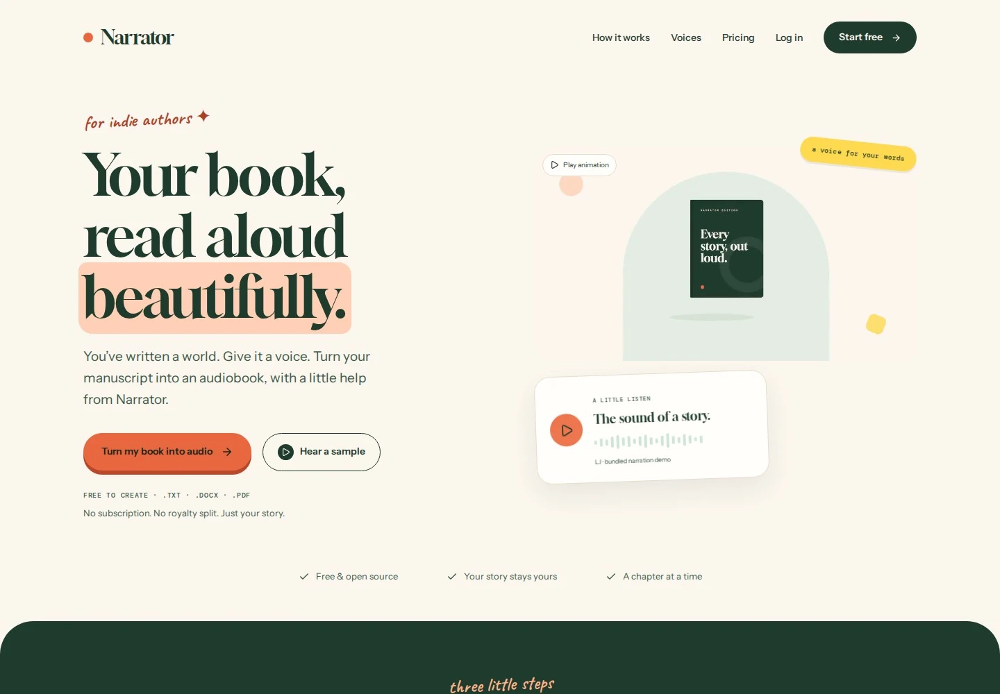

# Header animation

The uploaded **Book Unfolding.mp4** replaces the landing hero photograph and overlapping cover illustration. Book-cover placeholders elsewhere in the author studio are unchanged. The GitHub links were removed from both the sidebar and landing footer.

## Media delivery

| Asset | Size | Format |
| --- | ---: | --- |
| Original upload | 2,690,739 bytes | 1280 × 720, 30 fps |
| Preferred video | 218,585 bytes | H.264 MP4, 960 × 540, 24 fps |
| Codec fallback | 226,455 bytes | VP9 WebM, 960 × 540, 24 fps |
| Still poster | 5,826 bytes | WebP, 960 × 540 |

The MP4 is approximately 92% smaller than the upload. Its `moov` atom precedes `mdat`, enabling playback without waiting for the whole file. Both video variants omit audio. Browsers select one supported source; the page does not intentionally fetch both.

`HeroVideo` uses native muted, inline, looping playback. Its aspect ratio is reserved before the media loads. A small poster is preloaded; video sources are attached only when the illustration enters the viewport and automatic playback is allowed. Offscreen and hidden-tab playback pauses. An accessible pause/play button gives users control. Reduced-motion and data-saving preferences keep the poster until the user explicitly requests playback.

Media filenames contain content hashes. `/video/` assets receive `Cache-Control: public, max-age=31536000, immutable`; changing the file also changes its URL. The implementation does not drive frame-by-frame animation through React, canvas, or JavaScript timers.

## Checks

- Production build and TypeScript validation passed.
- Chromium desktop playback and a complete loop: 300 video frames, zero dropped frames in this test environment. This is a local measurement, not a guarantee for every device/network.
- Mobile inline playback, pause/play, offscreen pause/resume and hidden-tab pause/resume passed.
- Reduced motion and data saving attached no video sources and issued no MP4/WebM requests; explicit playback worked.
- Immutable caching was verified on the served media response.
- No page errors or horizontal overflow at 320, 390, 768 or 1440 px.
- Landing Axe WCAG 2 A/AA and 2.1 AA checks passed. Automated checks do not replace manual accessibility review.
- Desktop and mobile screenshots were visually reviewed. No live deployment was changed.

